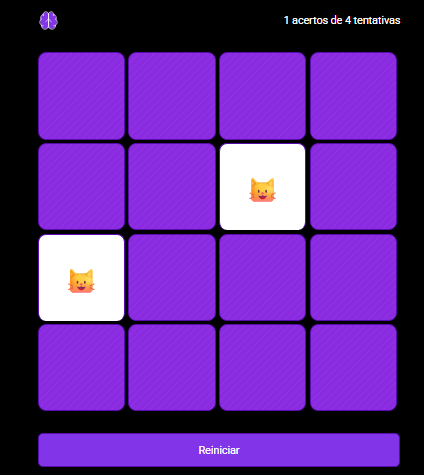

# 📚 Jogo da Memória

## 📸 Preview

Um projeto simples e divertido de **Jogo da Memória** desenvolvido com **HTML, CSS e JavaScript puro**.

O jogador precisa encontrar todos os pares de cartas com emojis de animais.

---

🔗 [Acesse o projeto publicado no GitHub Pages](https://adnilsonjr.github.io/Memory/)

---

## 🚀 Funcionalidades

* Embaralhamento automático das cartas
* Sistema de tentativas e acertos
* Verificação de pares
* Bloqueio durante animação de comparação
* Reinício da partida
* Interface responsiva e estilizada

---

## 🛠 Tecnologias

* HTML5
* CSS3
* JavaScript

